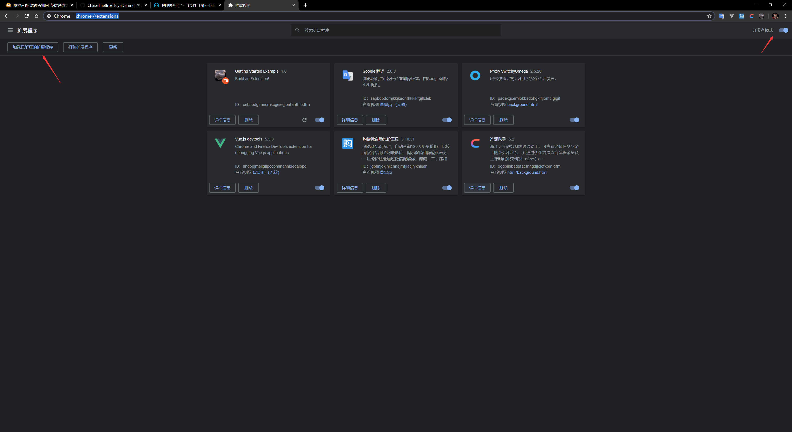

# 虎牙弹幕独轮车Chrome辅助插件

## 功能

- 自动无限复读
- 每秒100次光速发弹幕

## 安装方法

- 将manifest.json中的炫狗直播间[https://www.huya.com/840747](https://www.huya.com/840747)改成任意你想要开独轮车的直播间，或者直接改成[https://www.huya.com/](https://www.huya.com/)，可以全虎牙生效；
- 在chrome浏览器中输入[chrome://extensions/](chrome://extensions/)，并将chrome浏览器开启开发者模式，之后点击加载已解压的扩展程序；

- 在弹出的文件管理中选中clone下来的目录即可完成插件的安装

## 使用方法

- 默认状态下无限复读模式关闭，点击“开车”按钮将会发送输入的弹幕100次
- 开启无限复读模式将会无限发送输入的弹幕

## TODO

- 针对虎牙的20秒发言限制进行优化
- 加入独轮车关键字的快速自定义，达到轻点鼠标就可以开独轮车的效果
